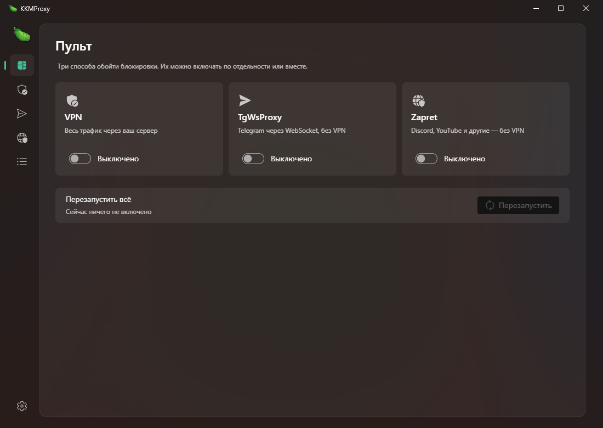
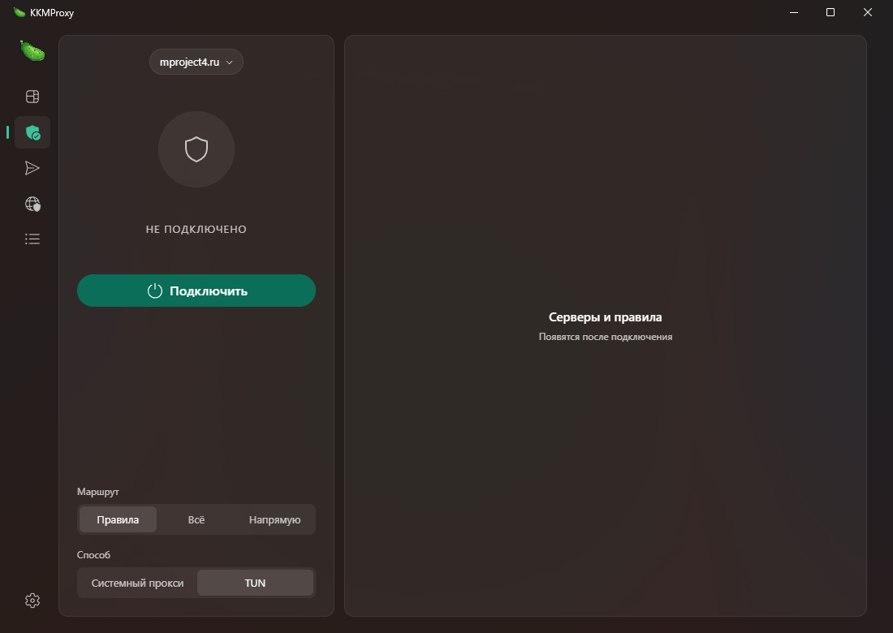
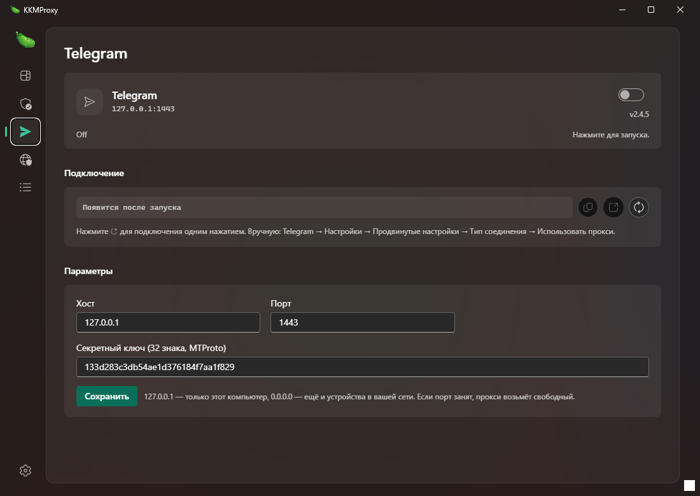
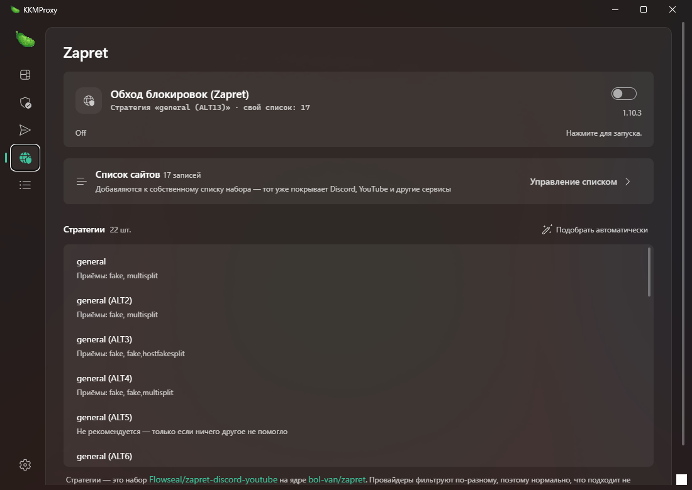
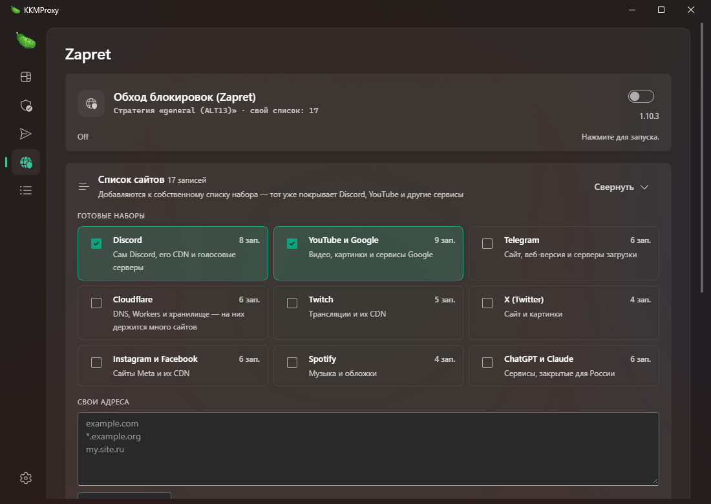
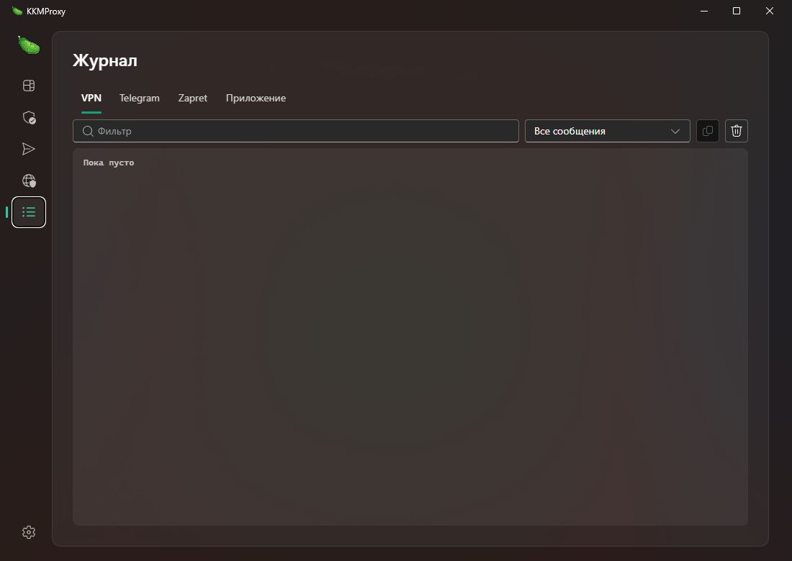
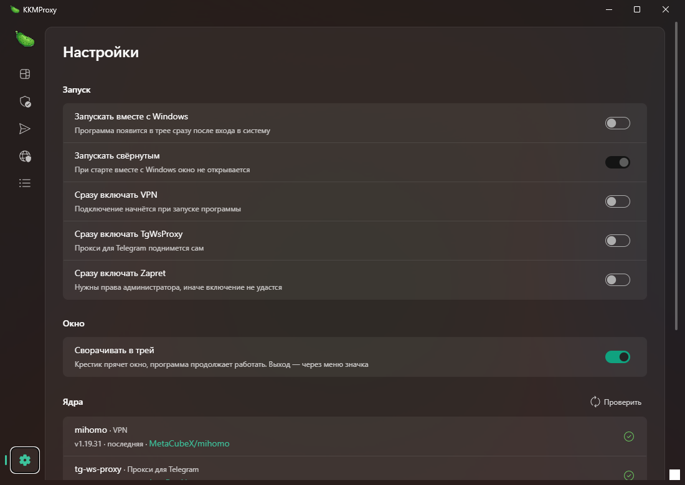

<div align="center">


# KKMProxy для Windows

**Три способа обойти блокировки в одном окне:** свой VPN, прокси для Telegram
и обход DPI без VPN.

Настольная версия [KKMProxy для Android](https://github.com/kukmber/KKMProxy).



</div>

---

## Содержание

- [Что это такое](#что-это-такое)
- [Установка](#установка)
- [Первый запуск](#первый-запуск)
- [Пульт](#пульт)
- [VPN](#vpn)
- [Telegram](#telegram)
- [Zapret — обход блокировок](#zapret--обход-блокировок)
- [Журнал](#журнал)
- [Настройки](#настройки)
- [Если что-то не работает](#если-что-то-не-работает)
- [Как правильно проверять, помогает ли обход](#как-правильно-проверять-помогает-ли-обход)
- [Где лежат файлы](#где-лежат-файлы)
- [Сборка из исходников](#сборка-из-исходников)
- [Как всё устроено внутри](#как-всё-устроено-внутри)
- [Планы](#планы)
- [Спасибо](#спасибо)

---

## Что это такое

KKMProxy — оболочка над тремя проверенными программами. Она сама скачивает их,
готовит им настройки, запускает, следит за состоянием и показывает журнал.
Способы обхода работают по-разному, и это хорошо: не помогает один — включается
другой.

| Способ | Что делает | Когда пригодится | Права администратора |
|---|---|---|---|
| **VPN** ([mihomo](https://github.com/MetaCubeX/mihomo)) | Весь трафик идёт через ваш сервер по подписке | Нужен доступ куда угодно и есть свой сервер | Только для режима TUN |
| **Telegram** ([tg-ws-proxy-rs](https://github.com/valnesfjord/tg-ws-proxy-rs)) | Telegram ходит через WebSocket | Telegram не грузит фото и не отправляет сообщения | Нет |
| **Zapret** ([набор Flowseal](https://github.com/Flowseal/zapret-discord-youtube) на ядре [bol-van/zapret](https://github.com/bol-van/zapret)) | Меняет пакеты так, что фильтр провайдера не узнаёт запрос | Discord, YouTube и другие — без VPN, на полной скорости | Да |

Все три можно включать по отдельности или вместе. **Кроме одного случая:** двух
программ обхода DPI одновременно быть не должно — об этом ниже.

---

## Установка

1. Скачайте `KKMProxy_0.1.0_x64-setup.exe` из
   [релизов](https://github.com/kukmber/KKMProxyPC/releases).
2. Запустите. Установка идёт **для текущего пользователя** — права
   администратора не нужны, программа ставится в `%LOCALAPPDATA%\KKMProxy`.
3. Windows SmartScreen может показать синее окно «Windows защитила ваш
   компьютер»: установщик пока не подписан сертификатом. Нажмите
   **«Подробнее» → «Выполнить в любом случае»**.
4. Ярлык появится в меню «Пуск». Удаляется обычным способом — через
   «Параметры → Приложения».

**Ядра скачивать вручную не нужно.** При первом включении раздела программа сама
возьмёт нужную версию из релизов на GitHub и положит в свою папку.

---

## Первый запуск

Программа открывается на **Пульте**. Дальше зависит от того, что нужно:

- **Нужен доступ ко всему и есть подписка** → раздел VPN, добавьте подписку.
- **Не работает Discord или YouTube** → раздел Zapret, включите обход.
- **Не работает Telegram** → раздел Telegram, запустите прокси и примените ссылку.

Для Zapret и режима TUN нужны права администратора — на странице будет кнопка
«Перезапустить от администратора», программа перезапустится сама.

---

## Пульт

Три переключателя и кнопка «Перезапустить».


- **Переключатель** включает и выключает способ, под ним идёт время работы.
- **Перезапустить** поднимает заново только то, что сейчас включено. Помогает,
  когда связь «залипла» после смены сети, Wi-Fi или выхода из спящего режима.
- Не включилось — наведите указатель на плитку, в подсказке будет причина.

Точка на значке слева показывает, что раздел работает, даже когда открыта
другая вкладка.

---

## VPN

Ядро — [mihomo](https://github.com/MetaCubeX/mihomo), то же, что во FlClashX.
Понимает Clash/Mihomo YAML, Reality, Hysteria2, xhttp и другие протоколы.



### Добавить подписку

Нажмите **«Добавить подписку»**:

1. **Ссылка** — вставьте адрес подписки. Если она уже скопирована, программа
   подставит её сама при открытии окна.
2. **Из буфера** — годится и для одной ссылки, и для списка серверов, и для
   целого конфига.
3. **Из файла** — `.yaml`, `.yml`, `.txt`, `.conf`.

Понимаются Clash/Mihomo YAML, base64 и ссылки `vless://`, `hysteria2://`,
`trojan://`, `ss://`, `vmess://`.

Под названием видно число серверов, когда подписка обновлялась, остаток трафика
и срок — если сервер присылает эти данные. Кнопка со стрелками обновляет
подписку, в меню «⋯» — переименовать, скопировать ссылку, удалить.

### Режимы

**Маршрут** — что отправлять через VPN:

- **Правила** — решают правила из подписки: зарубежное через VPN, российское напрямую.
- **Всё** — весь трафик через VPN.
- **Напрямую** — VPN не используется, ядро остаётся запущенным.

**Способ** — как перехватывается трафик:

- **Системный прокси** — программа прописывает себя в настройках Windows. Прав
  администратора не нужно, но некоторые программы прокси не замечают (часто
  игры и отдельные мессенджеры).
- **TUN** — виртуальный сетевой адаптер, через него идёт трафик всей системы,
  включая такие программы. **Нужны права администратора.**

### Серверы и правила

Справа переключатель **Серверы / Правила**.

- **Группы** и **протоколы** показаны сразу, у протокола указано число серверов.
- Флаг определяется по названию сервера. Не удалось определить страну — рисуется
  глобус, это не ошибка загрузки.
- Значок молнии проверяет задержку всех серверов, клик по числу — одного.
- Не ответил три раза подряд — помечается значком; программа сама перепроверяет
  такие серверы каждые 30 секунд и снимает отметку при первом успехе.
- При выборе сервера старые соединения закрываются, иначе они остались бы на
  прежнем.
- **Правила** — те, по которым ядро решает, куда слать запрос. Есть поиск по
  домену, типу или группе.

---

## Telegram

Локальный MTProto-прокси, который разговаривает с серверами Telegram через
WebSocket. Помогает, когда обычные подключения Telegram режут.



1. Нажмите тумблер — прокси запустится.
2. Нажмите **«Применить в Telegram»** (кнопка со стрелкой) — откроется Telegram
   с готовыми настройками, останется подтвердить.

Вручную: Telegram → Настройки → Продвинутые настройки → Тип соединения →
Использовать прокси. Соседняя кнопка копирует ссылку.

Что полезно знать:

- **Секрет постоянный** — ссылка не меняется от запуска к запуску, применять её
  в Telegram нужно один раз. Круглая кнопка со стрелками создаёт новый ключ,
  если прежний куда-то утёк; после этого ссылку надо применить заново.
- **Хост `127.0.0.1`** — прокси доступен только этому компьютеру. Поставьте
  `0.0.0.0`, чтобы им могли пользоваться другие устройства в вашей сети; в
  ссылку тогда подставится адрес компьютера в локальной сети.
- **Порт** по умолчанию 1443. Занят другой программой — прокси возьмёт свободный
  и напишет об этом под полем; ссылка будет уже с настоящим портом.
- **Число подключений** считает Windows: само ядро такой статистики не отдаёт.
- Список запасных доменов Cloudflare включён сразу — это второй путь до
  Telegram, когда основные адреса недоступны.

Убрать прокси: Telegram → Настройки → Продвинутые настройки → Тип соединения →
Без прокси.

---

## Zapret — обход блокировок

Discord, YouTube и другие сайты без VPN. Трафик остаётся прямым и идёт на полной
скорости — меняется только то, по чему фильтр провайдера узнаёт запрос.



**Нужны права администратора**: обход работает через драйвер WinDivert.

### Стратегии

Берутся из набора
[Flowseal/zapret-discord-youtube](https://github.com/Flowseal/zapret-discord-youtube):
два десятка готовых вариантов (`general`, `general (ALT)`, `general (ALT2)`…),
обкатанных на российских провайдерах. Программа читает их прямо из файлов
набора, поэтому после обновления ядра список пополняется сам.

Провайдеры фильтруют по-разному, и это нормально, что подходит не первая
стратегия. Варианты с пометкой «Не рекомендуется» стоит пробовать последними.

**Подобрать автоматически** прогоняет стратегии по очереди и показывает, сколько
сайтов открылось на каждой, вместе с замером **без обхода** — чтобы было видно,
помогает ли обход вообще. Лучшая отмечается значком и плашкой «лучшая» в списке.
Подбор занимает пару минут, связь на это время будет прерываться.

Можно вписать и свою строку аргументов `winws` — перед сохранением её проверяет
само ядро, неверный набор не сохранится.

### Список сайтов



У набора есть свой список (Discord, YouTube, Cloudflare и прочее). Ваш
добавляется к нему:

- **Готовые наборы** — отметьте нужные сервисы галочками.
- **Свои адреса** — по одному в строке, поддомены подхватываются сами.

Всё это пишется в `lists\list-general-user.txt` набора.

---

## Журнал



У каждого раздела своя вкладка: **VPN · Telegram · Zapret · Приложение**.

- Фильтр по тексту и по важности: все сообщения, предупреждения и ошибки,
  только ошибки.
- Кнопки справа — скопировать видимое и очистить.
- Прокрутка сама идёт вниз, пока вы не пролистнули вверх.

Если что-то не работает — сначала сюда.

---

## Настройки



**Запуск.** Запускать вместе с Windows, запускать свёрнутым, сразу включать
VPN / Telegram / Zapret.

**Окно.** Сворачивать в трей — если выключить, крестик полностью закрывает
программу и останавливает всё, что запущено.

**Ядра.** У каждого своя строка: установленная версия, последняя вышедшая и
ссылка на релизы.

- **Скачать / Обновить** — кнопка на каждое ядро по отдельности.
- **Обновить всё** — появляется, когда обновлений несколько.
- **Проверить** — сверяет версии с GitHub прямо сейчас.
- Раз в сутки версии проверяются сами: у значка настроек появится точка.
  Устанавливает обновление только кнопка — так новая версия ядра не изменит
  поведение внезапно.
- Работающее ядро при обновлении останавливается и запускается снова само.

---

## Если что-то не работает

### «Уже работает другой обход блокировок»

Обход DPI у вас уже включён чем-то ещё — GoodbyeDPI, отдельный zapret или
сборка вроде slipgate. **Две такие программы рвут сеть целиком:** обе
перехватывают одни и те же пакеты через WinDivert, и интернет пропадает.

Программа показывает путь к чужому файлу и не даёт запустить свой обход, пока та
работает. Выключите обход в ней и попробуйте снова.

### Пропал интернет

Выключите всё на Пульте. Не помогло — закройте программу: системный прокси
вернётся на место, а ядра остановятся вместе с ней (они привязаны к процессу
программы, Windows гасит их сама).

### «Нужны права администратора»

Режим TUN и Zapret работают через драйверы. Нажмите «Перезапустить от
администратора» — программа перезапустится сама и продолжит с того же места.

### Zapret включается, но ничего не меняется

- Проверьте, что нужный сайт попадает под обход: либо он есть в списке набора,
  либо добавьте его в **Список сайтов → Свои адреса**.
- Попробуйте другую стратегию или **Подобрать автоматически**.
- Убедитесь, что **не включён VPN** — иначе сайты открываются через него и
  разницы не будет видно.

### VPN не подключается

Смотрите Журнал, вкладку VPN. Частые причины: подписка устарела — обновите её
кнопкой; сервер не отвечает — выберите другой в списке справа.

### Telegram не видит прокси

Проверьте, что порт в ссылке совпадает с показанным на странице: если 1443
занят, программа берёт другой и пишет об этом.

### Программу ругает SmartScreen

Установщик не подписан сертификатом. «Подробнее» → «Выполнить в любом случае».

---

## Как правильно проверять, помогает ли обход

Это самая частая ошибка в измерениях, и на неё легко попасться.

1. **Выключите VPN.** Через него открывается всё, и любой обход будет выглядеть
   одинаково полезным.
2. **Выключите чужие программы обхода** — иначе вы проверяете их, а не эту.
3. Откройте сайт, который у вас **действительно не открывается**. Если он и так
   работает, обход ничего не изменит: он не ускоряет, а снимает блокировку.
4. Для Telegram: прокси нужен, только когда прямой доступ режут. Если Telegram
   и так работает, разницы вы не увидите.

Автоподбор поэтому и делает замер «Без обхода»: если с обходом открылось
столько же, он честно об этом пишет.

---

## Где лежат файлы

Настройки, подписки и скачанные ядра:

```
%LOCALAPPDATA%\io.github.kukmber.kkmproxypc
```

| Папка или файл | Что внутри |
|---|---|
| `settings.json` | настройки программы |
| `profiles.json` | список подписок |
| `profiles\` | сами конфиги подписок |
| `cores\mihomo`, `cores\tgws`, `cores\zapret` | скачанные ядра и их версии |
| `cores\zapret\lists\` | списки сайтов, включая ваш `list-general-user.txt` |
| `mihomo\` | рабочая папка VPN: конфиг, правила, geo-базы |

Сама программа — в `%LOCALAPPDATA%\KKMProxy`.

Чтобы начать с чистого листа, закройте программу и удалите папку с настройками.

---

## Сборка из исходников

Нужны [Node.js](https://nodejs.org/), [Rust](https://rustup.rs/) и
Visual Studio Build Tools с компонентом C++.

```bash
git clone https://github.com/kukmber/KKMProxyPC.git
cd KKMProxyPC
npm install
npm run tauri dev      # запуск с автоперезагрузкой
npm run tauri build    # установщик в src-tauri/target/release/bundle/nsis
```

Проверки:

```bash
cd src-tauri && cargo test    # разбор подписок, конфигов и стратегий
npx tsc --noEmit -p .         # типы интерфейса
```

**Если на сборку не хватает памяти** (релиз собирается с LTO и одним потоком
кодогенерации, это требовательно), соберите щадяще — файлы проекта менять не
нужно:

```powershell
$env:CARGO_PROFILE_RELEASE_LTO = "thin"
$env:CARGO_PROFILE_RELEASE_CODEGEN_UNITS = "16"
npm run tauri build
```

---

## Как всё устроено внутри

Tauri 2 (Rust) + React и Fluent UI. Интерфейс — веб-страница в окне Windows,
вся работа с процессами, правами и сетью — на Rust.

| Файл | Что делает |
|---|---|
| `src-tauri/src/vpn.rs` | запуск mihomo, проверка готовности, системный прокси |
| `src-tauri/src/config.rs` | итоговый конфиг: порты, контроллер, DNS, TUN, правила |
| `src-tauri/src/subscription.rs` | разбор подписок и ссылок |
| `src-tauri/src/tgproxy.rs` | прокси для Telegram и ссылка `tg://proxy` |
| `src-tauri/src/zapret.rs` | обход DPI: разбор стратегий набора, подбор, списки |
| `src-tauri/src/hostsets.rs` | готовые наборы доменов |
| `src-tauri/src/cores.rs` | версии ядер, проверка и обновление с GitHub |
| `src-tauri/src/child.rs` | общий запуск ядер: Job Object, журнал, падения |
| `src-tauri/src/winsys.rs` | права администратора, поиск процессов, версия Windows |
| `src/pages`, `src/components` | страницы и элементы интерфейса |

Решения, которые стоили отладки и потому закреплены в коде:

- Файлы правил и geo-базы скачиваются заранее и напрямую: пока mihomo тянет их
  сам, он не пропускает трафик. Что не скачалось — временно исключается из
  конфига вместе с правилами, которые на это ссылаются, и догружается уже через
  VPN с перечитыванием конфига без переподключения.
- Готовность ядра проверяется запросом к его же контроллеру через его SOCKS-порт
  (первым правилом идёт `IP-CIDR,127.0.0.1/32,DIRECT,no-resolve`). Так проверка
  не зависит от того, отвечает ли сервер VPN.
- DNS: `respect-rules: true` и российский резолвер в `proxy-server-nameserver` —
  иначе не разрешается адрес самого сервера, а зарубежный DoH недоступен.
- Набор zapret ждёт пользовательские списки, которые обычно создаёт его
  `service.bat`. Мы его не запускаем, поэтому файлы создаёт приложение — без них
  `winws` выходит с `cannot access ipset file` и **не работает ни одна
  стратегия**.
- Автоподбор на время проверки добавляет проверяемые домены в пользовательский
  список: к адресам вне списков обход не применяется, и результат всегда совпал
  бы с замером без обхода.
- Ссылку `tg://proxy` собирает сама программа: ядро иначе подставляет
  самостоятельно определённый адрес и при включённом VPN берёт его из диапазона
  fake-ip.
- Порт контроллера и секрет — случайные при каждом запуске.
- Сервер с испорченным ключом Reality пропускается при разборе ссылок: иначе
  из-за одного такого не запускается всё ядро.

---

## Планы

- [x] VPN: подписки, серверы, правила, режимы, системный прокси
- [x] Обновление ядер кнопкой и проверка раз в сутки
- [x] Прокси для Telegram с настройкой хоста, порта и ключа
- [x] Zapret: набор стратегий, списки сайтов, автоподбор
- [x] Пульт, автозапуск, журнал по разделам
- [x] Установщик
- [ ] Список активных соединений и правила по программам (`PROCESS-NAME`)
- [ ] Обновление самой программы из релизов
- [ ] Подпись установщика сертификатом

---

## Спасибо

Программа не делает ничего сама — всю работу выполняют:

- [MetaCubeX/mihomo](https://github.com/MetaCubeX/mihomo) — ядро VPN
- [valnesfjord/tg-ws-proxy-rs](https://github.com/valnesfjord/tg-ws-proxy-rs) —
  прокси для Telegram, порт [Flowseal/tg-ws-proxy](https://github.com/Flowseal/tg-ws-proxy)
- [bol-van/zapret](https://github.com/bol-van/zapret) — ядро обхода DPI
- [Flowseal/zapret-discord-youtube](https://github.com/Flowseal/zapret-discord-youtube) —
  набор стратегий и списков сайтов под российских провайдеров
- [romanvht/ByeByeDPI](https://github.com/romanvht/ByeByeDPI) и
  [hufrea/byedpi](https://github.com/hufrea/byedpi) — с них начиналась версия для Android
